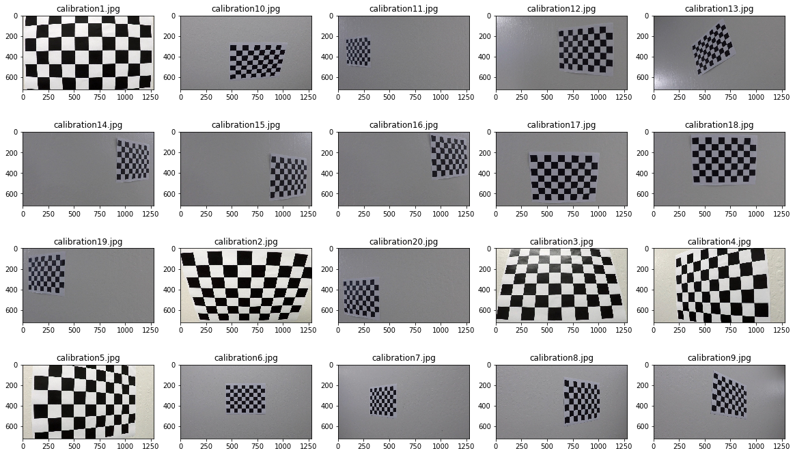
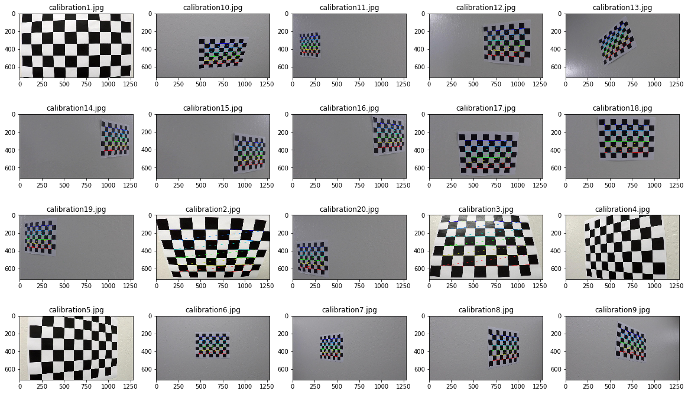
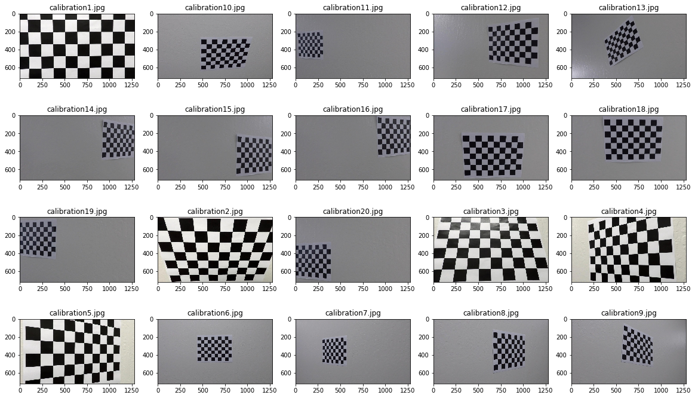
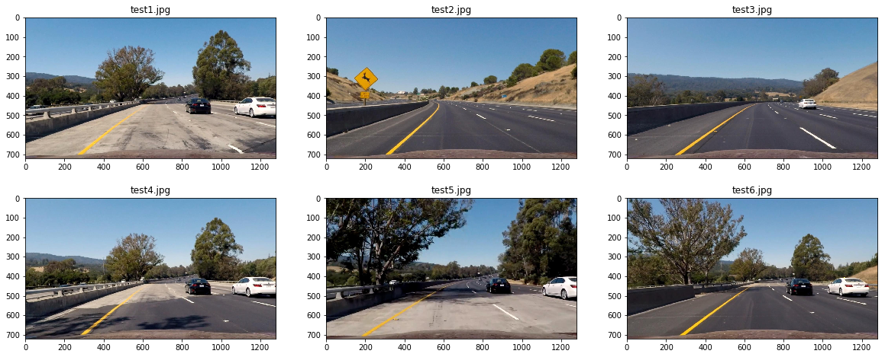
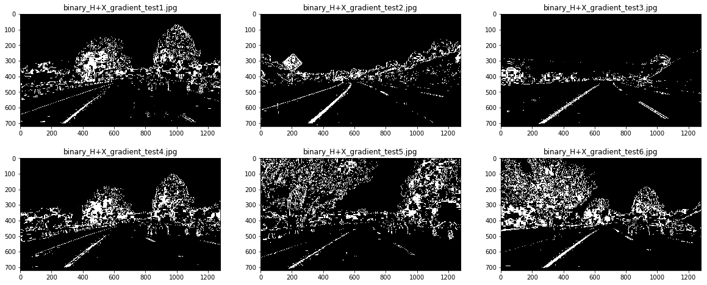
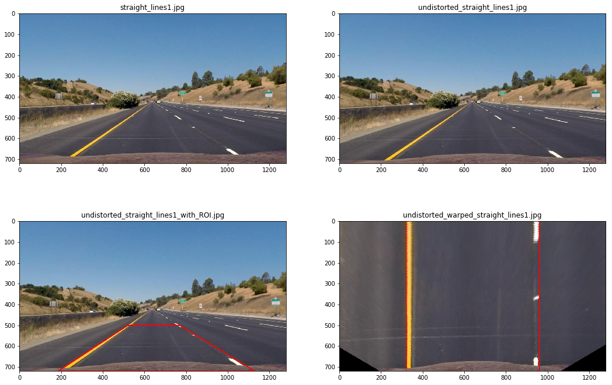
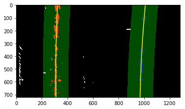
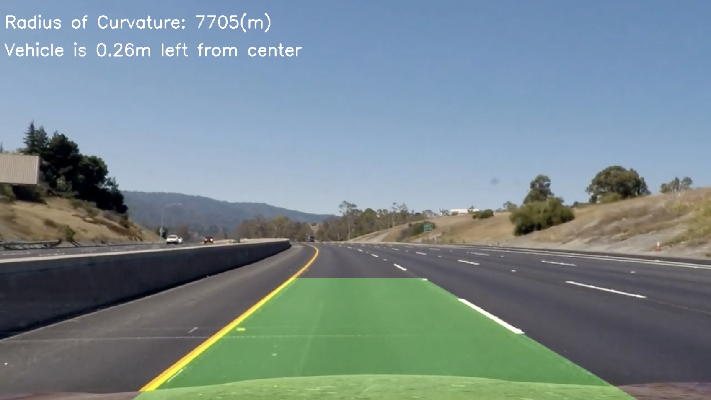

# **Advanced Lane Finding Project**

The goals / steps of this project are the following:

* Compute the camera calibration matrix and distortion coefficients given a set of chessboard images.
* Apply a distortion correction to raw images.
* Use color transforms, gradients, etc., to create a thresholded binary image.
* Apply a perspective transform to rectify binary image ("birds-eye view").
* Detect lane pixels and fit to find the lane boundary.
* Determine the curvature of the lane and vehicle position with respect to center.
* Warp the detected lane boundaries back onto the original image.
* Output visual display of the lane boundaries and numerical estimation of lane curvature and vehicle position.

# Description of the result files
- camera_cal/calibration*.jpg: distorted calibration images
- camera_cal/chessboard/calibration*.jpg: calibration images with detected corners
- output_images/calibration/calibration*.jpg: undistorted images for camera calibration
- test_images/test*.jpg: distorted video frames
- output_images/undistorted/test*.jpg: undistorted video frames
- output_images/ctransformed/binary\_H+X\_gradient\_*.jpg: filtered images
- frames_project_video/frame*.jpg: videoframes of the file project_video.mp4
- output_images/video_output.mp4: generated video output containing all files used to filter single colour channels, gradient in x and y directions, gradient magnitude, combined gradient direction from video images.


# Compute The calibration matrix and distortion coefficients given a set of chessboard images


In this step I first find the images points and the objects points.
The intuition here is to map the coordinates of the corners in the given 2D image which we call image points to the 3D coordinates undistorted chessboard corners, which we call object points. 

The object points are prepared from the left upper to the bottom right of the image like (0, 0, 0), (1, 0, 0), (2, 0, 0), ..., (9, 5, 0), where: the z-Coordinate is 0 for all three points since the image is on a flat image plane, x and y are the coordinates of all the corners. 

I then used the output `objpoints` and `imgpoints` to compute the camera calibration and distortion coefficients using the `cv2.calibrateCamera()` function.  I applied this distortion correction to the test image using the `cv2.undistort()` function and obtained the undistorted images below: 


### Distorted Images



### Images with detected corners



### Undistorted images



# Apply a distortion correction to raw images

### Distorted frames


### Undistorted video frames



# Using Color transforms, gradients to create a thresholded binary image

The file filters.py contains all necessary methods to filter various colours channels from an image and to create binary images based on chosen channels. In order to achieve good result i have implemented a tool to help me visualize (see [Repository](https://github.com/ValeryToda/ImageFilter)) changes of images content depending on the applied threshold on a given channel. After playing around with the filters i came to the conclusion that the combination of thresholded H-Channel and the the thresholded x-gradient is the suitable choice that helps to retain the most information of the lanes with respect to the critical frames (see test1.jpg, test4.jpg, test5.jpg) of the project video. I have used ffmpeg to extract all the frame of the project video and have applied the binary filter to make sure that the chosen thresholds retain the most information about the lanes over the whole video.


### Visualize transformed images




### Generate new video based on transformed single frames 

> cd ./output_images/offline/

> ffmpeg -f image2 -i tframe-%04d.jpg -vcodec libx264 -crf 25 -r 25 -b 4000 -pix_fmt yuv420p transformed_video.mp4

Description:

- bitrate(-b 4000)
- frames per second (-r 25) 
- quality (-crf 15)
- codec (-vcodec libx264)
- pixel format (-pix_fmt yuv420p)


### Visualize transformed video 

<video width="850" height="540" controls>
  <source src="./output_images/offline/transformed_video.mp4">
</video>


# Apply a perspective transform to rectify binary image

The code below describe how the perspective transformation is implemented. The `warper()` function takes as inputs an image (`img`), as well as source (`src`) and destination (`dst`) points.  I chose the hardcode the source and destination points in the following manner:

```python

src = np.float32([[520, 500], [185, 720], [1130, 720], [768, 500]])
dst = np.float32([[320, 0], [320, 720], [960, 720], [960, 0]])

def warper(img, src, dst):
    # Image size 
    img_size = (img.shape[1], img.shape[0])
    # Compute and apply perpective transform
    M = cv2.getPerspectiveTransform(src, dst)
    warped = cv2.warpPerspective(img, M, img_size, flags=cv2.INTER_NEAREST)  # keep same size as input image

    return warped
```

I verified that my perspective transform was working as expected by drawing the `src` and `dst` points onto a test image and its warped counterpart to verify that the lines appear parallel in the warped image.


### Plot images (distorted, undistorted, warped)




# Detect lane pixels and fit to find the lane boundary

In order to detect the lanes, i needed to preprocess each frame. The preprocessing consists of generating the binary image and to warping it. Then i applied the sliding window algorithmus. Then I fitted the found points with a 2nd order polynomial through the call of the function `findlanes` from the module `lanefinder.py`. To fit the lane i call the function `fitlanes` from the same module (see below). 

The outliers were dropped by checking the minimum and maximum distance between the lanes. Whenever the outliers are dropped, the mean of the lanes points within the previous frames is considered.



# Determine the curvature of the lane and vehicle position with the respect to center. Warp the detected lane boundaries and numerical estimation of lane curvature and vehicle position

The curvature of the lane is calculated using the formula provided [here](https://www.intmath.com/applications-differentiation/8-radius-curvature.php). `self.left_curverad` represents the curvature of the left lane and `self.right_curverad` the curvature of the right lane. 

```python
	# Define conversions in x and y from pixels space to meters
	YM_PER_PIX = 30/720 # meters per pixel in y dimension
	XM_PER_PIX = 3.7/700 # meters per pixel in x dimension
          
def _calc_curvature(self, ploty, l_fitx, r_fitx):
    # Fit new polynomials to x,y in world space
    y_eval = np.max(ploty)
    left_fit_cr = np.polyfit(ploty*YM_PER_PIX, l_fitx*XM_PER_PIX, 2)
    right_fit_cr = np.polyfit(ploty*YM_PER_PIX, r_fitx*XM_PER_PIX, 2)
    
    # Calculate the new radii of curvature
    self.left_curverad = ((1 + (2*left_fit_cr[0]*y_eval*YM_PER_PIX + left_fit_cr[1])**2)**1.5) / np.absolute(2*left_fit_cr[0])
    self.right_curverad = ((1 + (2*right_fit_cr[0]*y_eval*YM_PER_PIX + right_fit_cr[1])**2)**1.5) / np.absolute(2*right_fit_cr[0])        
```
the code below described the implementation of the position of vehicle with respect to the center of the lane

```python        
    # calculate center of lane
    center_of_lane = (self.left_fitx[-1] + self.right_fitx[-1])/2
    
    # calculate vehicle offset
    self.vehicle_offset = np.abs(center_of_lane - frame.shape[1]/2)
```
# Warp the detected lane boundaries back onto the original image.
I implemented this step in `calibration.ipynb` in the function `set_region_on_frame()`.  Here is an example of my result on a test image:




# Output visual display of the lane boundaries and numerical estimation of lane curvature and vehicle position

<video width="850" height="540" controls>
  <source src="./output_images/video_output.mp4">
</video>


# Discussion
Overall this approach of lane detection is good but not robust enough to be generalised to more complex use cases including rain conditions, night, light conditions with shadows. The searching aloritthmus could be improved by taking into consideration the lane finding could fail at the first frame or for a long period of time (more frames).
